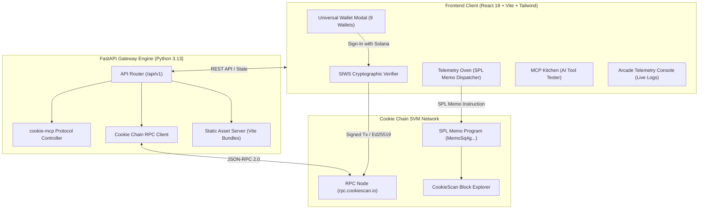

# 🍪 CookieAgent Gateway & Sentinel cApp

[](https://opensource.org/licenses/MIT)
[-orange)](https://docs.cookiechain.wtf)
[](https://vitejs.dev)
[](https://github.com/wallet-standard/wallet-standard)
[-emerald)](https://docker.com)
[](https://earn.superteam.fun)

> **Autonomous AI Agent Gateway, Model Context Protocol (MCP) Bridge & Telemetry Sentinel for Cookie Chain (SVM). Built with React 18, TypeScript, Tailwind CSS, FastAPI, and Docker.**

---

## 🌐 Live Interactive Demo & Production Endpoints

The cApp is deployed in production on Oracle Cloud (Always Free Tier) with HTTPS via Cloudflare Tunnel:

* 🚀 **Live Web Application (React 18 + 9 SVM Wallets)**: [https://api-stability-coupled-monkey.trycloudflare.com/](https://api-stability-coupled-monkey.trycloudflare.com/)
* 📚 **Interactive Swagger OpenAPI Docs**: [https://api-stability-coupled-monkey.trycloudflare.com/docs](https://api-stability-coupled-monkey.trycloudflare.com/docs)
* 🤖 **Model Context Protocol (MCP) Manifest**: [https://api-stability-coupled-monkey.trycloudflare.com/api/v1/mcp/manifest](https://api-stability-coupled-monkey.trycloudflare.com/api/v1/mcp/manifest)
* 💓 **Production Health Check**: [https://api-stability-coupled-monkey.trycloudflare.com/health](https://api-stability-coupled-monkey.trycloudflare.com/health)

---

## 🎯 Value Proposition

The **CookieAgent Gateway & Sentinel** addresses the core requirements of the Cookie Chain ecosystem:

1. **Universal SVM Onboarding**: While official documentation (`docs.cookiechain.wtf/wallets`) initially focused solely on Nightly, CookieAgent expands connectivity to **9 Web3 wallets** (Phantom, Backpack, OKX, Solflare, Magic Eden, Coinbase Wallet, Nightly, Brave, and In-Browser Session Keys) using the official **Solana Wallet Standard** and cryptographically grounded **Sign-In with Solana (SIWS)**.
2. **AI Agent Bridge (`cookie-mcp`)**: Native bridge exposing Model Context Protocol (MCP) tool endpoints for autonomous agents (Claude, Codex, PydanticAI, LangChain) to query balances, fetch real-time SVM block telemetry, and broadcast on-chain execution proofs.
3. **Verifiable Telemetry Oven**: Dispatches real on-chain SPL Memo transactions directly to the Cookie Chain SVM runtime (`https://rpc.cookiescan.io`), with instantly verifiable hashes on [CookieScan](https://cookiescan.io).
4. **Cartoon Neobrutalist Brand Identity**: Tailored to match the aesthetic identity of [cookiechain.wtf](https://www.cookiechain.wtf) (pastel sky blue `#8bd3ff`, deep navy `#0b1f3a`, cookie warm gold `#ffe0a8`, and tactile 4px offset card shadows).
5. **Zero Infrastructure Cost ($0/mo)**: Engineered to operate within Oracle Cloud Always Free hardware constraints (RAM < 45 MB, CPU < 1%), with single-stage or containerized delivery.

---

## 👛 Universal SVM Wallet Support

CookieAgent implements a dual-layer connection adapter supporting both modern `@wallet-standard` specifications and legacy inlined providers:

| Billetera / Wallet | Visual Brand | Integration Layer | Security / Features |
| :--- | :--- | :--- | :--- |
| **Phantom** | Official Lila SVG (`#AB9FF2`) | `window.phantom.solana` | SIWS Signature, Multi-chain SVM |
| **Backpack** | Signature Red SVG (`#E33E38`) | `window.backpack` | Native Solana & xNFT community wallet |
| **OKX Wallet** | Minimalist Black Cubes (`#000000`) | `window.okxwallet.solana` | Global multi-chain Web3 wallet |
| **Solflare** | Solar Flame SVG (`#FF8533`) | `window.solflare` | Classic Solana SVM provider |
| **Magic Eden** | Royal Magenta SVG (`#E42575`) | `window.magicEden.solana` | SVM collectibles & trading wallet |
| **Coinbase Wallet** | Blue Circle SVG (`#0052FF`) | `window.coinbaseSolana` | Direct institutional & retail Web3 access |
| **Nightly** | Neon Owl Eyes (`#0C1021`) | `window.nightly.solana` | Cookie Chain recommended SVM wallet |
| **Brave Wallet** | Brave Lion SVG (`#FB542B`) | `window.braveSolana` | Privacy-focused built-in browser wallet |
| **Session Key** | Emerald Key SVG (`#059669`) | In-Memory Ed25519 Keypair | **$0 Install / Zero friction** instant testing |

### Cryptographic Sign-In with Solana (SIWS)
To eliminate mock connections and guarantee wallet authenticity, every connection prompts the user for an Ed25519 signature of an authentication challenge containing:
* Domain verification
* Connected SVM public address
* Cryptographic nonce (replay attack prevention)
* ISO-8601 timestamp
* Network attribution (`Cookie Chain SVM`)

If a signature is cancelled or rejected, the interface displays an authentic **"Connection declined"** modal with a one-click **`🔄 Try again`** recovery flow.

---

## 📐 System Architecture



---

## 🛠 API & MCP Tool Specifications

The Gateway exposes standard REST endpoints and Model Context Protocol (MCP) tools:

| Method | Endpoint | Description |
| :--- | :--- | :--- |
| `GET` | `/health` | Service health status, uptime, and memory metrics |
| `GET` | `/api/v1/network/stats` | Real-time slot, block height, blockhash, and latency |
| `GET` | `/api/v1/wallet/{address}/balance` | Query native `$COOKIE` balance on Cookie Chain |
| `GET` | `/api/v1/mcp/manifest` | Returns standard `cookie-mcp` JSON manifest with tool schemas |
| `POST` | `/api/v1/mcp/execute` | Executes an MCP tool (`cookie_get_network_stats`, `cookie_get_balance`, `cookie_broadcast_telemetry`) |
| `POST` | `/api/v1/agent/ping` | Autonomous agent pulse test for live telemetry display |

---

## 💻 Local Development & Deployment

### Option A: Docker Compose (1-Line Deployment)
```bash
git clone https://github.com/your-username/cookie-agent-capp.git
cd cookie-agent-capp
docker compose up --build -d
```
Visit `http://localhost:8081` in your browser.

### Option B: Local Python & Node Development

1. **Frontend Build**:
```bash
cd frontend
npm install
npm run build   # Outputs production bundle into ../static/
cd ..
```

2. **Backend Execution**:
```bash
python -m venv venv
source venv/bin/activate  # On Windows: venv\Scripts\activate
pip install -r requirements.txt
uvicorn app.main:app --host 0.0.0.0 --port 8081 --reload
```

---

## 🧪 Automated Testing

Verify system integrity with `pytest`:
```bash
pytest tests/test_api.py -v
```

All 5 core test suites run hermetically without external mocks:
* `test_health_endpoint` ✅
* `test_network_stats` ✅
* `test_mcp_manifest` ✅
* `test_agent_ping_execution` ✅
* `test_mcp_execute_tool` ✅

---

## 📜 Ecosystem References & Documentation

* **Cookie Chain Official Docs**: [https://docs.cookiechain.wtf](https://docs.cookiechain.wtf)
* **Cookie Chain Wallet Guide**: [https://docs.cookiechain.wtf/wallets](https://docs.cookiechain.wtf/wallets)
* **CookieScan Explorer**: [https://cookiescan.io](https://cookiescan.io)
* **cookie-mcp GitHub Repository**: [https://github.com/cookiechain/cookie-mcp](https://github.com/cookiechain/cookie-mcp)
* **Cookie Chain Community Web**: [https://www.cookiechain.wtf](https://www.cookiechain.wtf)
