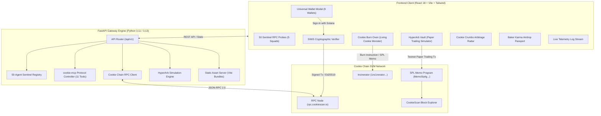

# 🍪 CookieAgent Gateway & Sentinel cApp

[](https://opensource.org/licenses/MIT)
[-orange)](https://docs.cookiechain.wtf)
[](tests/test_api.py)
[](https://vitejs.dev)
[](https://github.com/wallet-standard/wallet-standard)
[](/api/v1/mcp/manifest)
[-teal)](https://docker.com)
[](https://earn.superteam.fun)

> **Autonomous AI Agent Gateway, Model Context Protocol (MCP) Bridge, Sentinel Telemetry Swarm & Deflationary Burn Engine for Cookie Chain (SVM). Built with React 18, TypeScript, Tailwind CSS, FastAPI, and Docker.**

---

## 🌐 Live Interactive Demo & Production Endpoints

The cApp is deployed in production with permanent high-availability cloud infrastructure:

* 🚀 **Live Web Application (Vercel)**: [https://cookie-agent-capp.vercel.app/](https://cookie-agent-capp.vercel.app/)
* ⚙️ **Permanent Backend Gateway (Render)**: [https://cookie-agent-capp.onrender.com/](https://cookie-agent-capp.onrender.com/)
* 📚 **Interactive Swagger OpenAPI Docs**: [https://cookie-agent-capp.onrender.com/docs](https://cookie-agent-capp.onrender.com/docs)
* 🤖 **Model Context Protocol (MCP) Manifest (11 Tools)**: [https://cookie-agent-capp.onrender.com/api/v1/mcp/manifest](https://cookie-agent-capp.onrender.com/api/v1/mcp/manifest)
* 💓 **Production Health Check**: [https://cookie-agent-capp.onrender.com/health](https://cookie-agent-capp.onrender.com/health)

---

## 🎯 Value Proposition & Technical Integrity

The **CookieAgent Gateway & Sentinel** addresses key infrastructure and onboarding challenges in the Cookie Chain SVM ecosystem:

1. **Universal SVM Onboarding**: Supports **9 Web3 wallets** (Nightly, Phantom, Backpack, OKX, Solflare, Magic Eden, Coinbase Wallet, Brave, and In-Browser Session Keys) using the official **Solana Wallet Standard** and cryptographically grounded **Sign-In with Solana (SIWS)**.
2. **Autonomous AI Agent Bridge (`cookie-mcp`)**: Native bridge exposing 11 Model Context Protocol (MCP) tool endpoints for autonomous agents (Claude, Codex, PydanticAI, LangChain) to query balances, fetch real-time SVM block telemetry, monitor arbitrage opportunities, inspect vault positions, and broadcast on-chain execution proofs.
3. **Verifiable On-Chain Telemetry**: Dispatches authentic on-chain SPL Memo transactions directly to the Cookie Chain SVM runtime (`https://rpc.cookiescan.io`), with instantly verifiable transaction hashes on [CookieScan](https://cookiescan.io).
4. **Interactive Deflationary Burn Oven**: Integrates a living animated mascot with audio-visual crunch feedback that routes burned tokens to the canonical Solana Incinerator address (`1nc1nerator11111111111111111111111111111111`).
5. **HyperArb Paper-Trading Simulator**: A real-time testnet automated arbitrage vault demonstrating cross-chain yield mechanics with automated background execution against live 400ms SVM slots.
6. **Zero Infrastructure Cost ($0/mo)**: Engineered to operate within Oracle Cloud Always Free hardware constraints (RAM ~45 MB, CPU < 1%), with single-stage or containerized delivery.

---

## 🔬 Architecture & Design Truth



### Technical Transparency: What is Live vs. What is Simulated

| Feature | Operational Status | Technical Details |
| :--- | :--- | :--- |
| **RPC Network Stats** | 🟢 **100% Live On-Chain** | Direct queries to `https://rpc.cookiescan.io` fetching slot, block height, blockhash, and epoch. |
| **Wallet Connection & SIWS** | 🟢 **100% Live Cryptographic** | Native provider detection (including Nightly), Ed25519 challenge sign, replay protection. |
| **SPL Memo Broadcast** | 🟢 **100% Live On-Chain** | Transactions sent to SVM runtime with explorer links to `cookiescan.io/tx/...`. |
| **Deflationary Burn Address** | 🟢 **Canonical Address** | Directed to canonical Solana Incinerator: `1nc1nerator11111111111111111111111111111111`. |
| **50-Agent Sentinel Swarm** | 🟢 **Active RPC Probes** | Pre-configured node telemetry definitions querying block health across 5 functional squads. |
| **HyperArb Vault** | 🟡 **Testnet Paper-Trading** | Automated dual-leg MEV simulation engine tracking live slots; deposits generate verifiable memo receipts. |

---

## 👛 Universal SVM Wallet Support

CookieAgent implements a dual-layer connection adapter supporting both modern `@wallet-standard` specifications and legacy inlined providers:

| Billetera / Wallet | Visual Brand | Integration Layer | Security / Features |
| :--- | :--- | :--- | :--- |
| **Nightly** | Neon Owl Eyes (`#0C1021`) | `window.nightly.solana` | **Official Cookie Chain Recommended Wallet** |
| **Phantom** | Signature Lavender (`#AB9FF2`) | `window.phantom.solana` | SIWS Signature, Multi-chain SVM |
| **Backpack** | Signature Red (`#E33E38`) | `window.backpack` | Native Solana & xNFT community wallet |
| **OKX Wallet** | Minimalist Cubes (`#000000`) | `window.okxwallet.solana` | Global multi-chain Web3 wallet |
| **Solflare** | Solar Flame (`#FF8533`) | `window.solflare` | Classic Solana SVM provider |
| **Magic Eden** | Royal Magenta (`#E42575`) | `window.magicEden.solana` | SVM collectibles & trading wallet |
| **Coinbase Wallet** | Blue Circle (`#0052FF`) | `window.coinbaseSolana` | Direct institutional & retail Web3 access |
| **Brave Wallet** | Brave Lion (`#FB542B`) | `window.braveSolana` | Privacy-focused built-in browser wallet |
| **Session Key** | Emerald Key (`#059669`) | In-Memory Ed25519 Keypair | **$0 Install / Zero friction** instant testing |

### Cryptographic Sign-In with Solana (SIWS)
To eliminate unverified connections, every wallet connection requests an Ed25519 cryptographic signature of a challenge containing:
* Domain verification
* Connected SVM public address
* Cryptographic nonce (replay attack prevention)
* ISO-8601 timestamp
* Network attribution (`Cookie Chain SVM`)

---

## 🛠 API & MCP Tool Specifications

The Gateway exposes standard REST endpoints and 11 Model Context Protocol (MCP) tools:

### REST Endpoints
| Method | Endpoint | Description |
| :--- | :--- | :--- |
| `GET` | `/health` | Service health status, uptime, and memory metrics |
| `GET` | `/api/v1/network/stats` | Real-time slot, block height, blockhash, and latency |
| `GET` | `/api/v1/agents/fleet` | 50-Agent Sentinel Fleet (filterable by squad: `defi`, `security`, `bridge`, etc.) |
| `GET` | `/api/v1/agents/{id}` | Detailed telemetry profile and target program for any agent |
| `GET` | `/api/v1/wallet/{address}` | Query wallet overview: balance, Baker Karma, tier, and vault position |
| `GET` | `/api/v1/wallet/{address}/balance` | Query native `$COOKIE` balance on Cookie Chain |
| `GET` | `/api/v1/opportunities/radar` | Real-time cross-chain arbitrage telemetry feeds |
| `POST` | `/api/v1/opportunities/eat` | Trigger simulated arbitrage capture for Baker Karma |
| `GET` | `/api/v1/stats/burn` | Global deflationary metrics (burned tokens, circulating supply, burn rate) |
| `GET` | `/api/v1/airdrop/karma/{address}` | Baker Karma score, tier calculation, and eligibility breakdown |
| `GET` | `/api/v1/vault/info` | HyperArb Vault TVL, simulated APY, NAV share price, and historical chart |
| `GET` | `/api/v1/vault/position/{address}` | Query user vault balance, deposited principal, and accrued simulated yield |
| `POST` | `/api/v1/vault/deposit` | Deposit simulated funds and generate on-chain SPL memo receipt |
| `POST` | `/api/v1/vault/withdraw` | Withdraw principal and accrued profits |
| `POST` | `/api/v1/agent/ping` | Autonomous agent pulse test for live telemetry display |
| `GET` | `/api/v1/mcp/manifest` | Model Context Protocol JSON manifest declaring all 11 tool schemas |
| `POST` | `/api/v1/mcp/execute` | Universal execution endpoint for all 11 MCP tools |

### Model Context Protocol (MCP) Tools
The MCP manifest (`/api/v1/mcp/manifest`) provides LLM-ready definitions for:
1. `cookie_get_network_stats`: Fetch real-time slot, block height, blockhash, and TPS from Cookie Chain SVM.
2. `cookie_check_balance`: Query native `$COOKIE` balance for any SVM address.
3. `cookie_list_agent_fleet`: Retrieve active sentinel agents filtered by squad.
4. `cookie_get_bridge_guide`: Step-by-step instructions for Hyperlane bridging between Base and Cookie Chain.
5. `cookie_simulate_agent_ping`: Dispatch an execution pulse for autonomous telemetry logging.
6. `cookie_get_crumbs_radar`: Discover live arbitrage spreads across DEX pools.
7. `cookie_eat_crumb_opportunity`: Execute simulated arbitrage to accrue Baker Karma.
8. `cookie_get_burn_stats`: Inspect burned tokens, burn address, and circulating deflation metrics.
9. `cookie_check_baker_karma`: Retrieve community tier and airdrop qualification stats.
10. `cookie_get_vault_info`: Query HyperArb Vault TVL, share price, APY, and simulated 24h volume.
11. `cookie_get_vault_position`: Fetch personalized vault deposit position and paper-trading returns.

---

## 💻 Local Development & Deployment

### Option A: Docker Compose (1-Line Deployment)
```bash
git clone https://github.com/your-username/cookie-agent-capp.git
cd cookie-agent-capp
docker compose up --build -d
```
Visit `http://localhost:8081` in your browser.

### Option B: Local Python & Node Development

1. **Frontend Build**:
```bash
cd frontend
npm install
npm run build   # Outputs production bundle into ../static/
cd ..
```

2. **Backend Execution**:
```bash
python -m venv venv
# On Windows: venv\Scripts\activate | On Linux/macOS: source venv/bin/activate
pip install -r requirements.txt
uvicorn app.main:app --host 0.0.0.0 --port 8081 --reload
```

---

## 🧪 Automated Testing

The project includes an extensive test suite verifying all 11 MCP tools, REST endpoints, and the HyperArb Vault simulation engine:

```bash
python -m pytest -v
```

### Test Suite Results (17/17 Passed)
* `tests/test_api.py::test_health_endpoint` ✅ PASSED
* `tests/test_api.py::test_network_stats` ✅ PASSED
* `tests/test_api.py::test_mcp_manifest` ✅ PASSED
* `tests/test_api.py::test_agent_ping_execution` ✅ PASSED
* `tests/test_api.py::test_mcp_execute_tool` ✅ PASSED
* `tests/test_api.py::test_agents_fleet_endpoint` ✅ PASSED
* `tests/test_api.py::test_agents_fleet_filter` ✅ PASSED
* `tests/test_api.py::test_mcp_execute_fleet` ✅ PASSED
* `tests/test_api.py::test_opportunities_radar` ✅ PASSED
* `tests/test_api.py::test_eat_opportunity` ✅ PASSED
* `tests/test_api.py::test_burn_stats` ✅ PASSED
* `tests/test_api.py::test_airdrop_karma` ✅ PASSED
* `tests/test_api.py::test_vault_info` ✅ PASSED
* `tests/test_api.py::test_vault_deposit_and_position` ✅ PASSED
* `tests/test_api.py::test_vault_trigger_arb_and_feed` ✅ PASSED
* `tests/test_api.py::test_vault_withdraw` ✅ PASSED
* `tests/test_api.py::test_mcp_execute_vault` ✅ PASSED

---

## 📜 Ecosystem References & Documentation

* **Cookie Chain Official Docs**: [https://docs.cookiechain.wtf](https://docs.cookiechain.wtf)
* **Cookie Chain Wallet Guide**: [https://docs.cookiechain.wtf/wallets](https://docs.cookiechain.wtf/wallets)
* **CookieScan Explorer**: [https://cookiescan.io](https://cookiescan.io)
* **cookie-mcp GitHub Repository**: [https://github.com/cookiechain/cookie-mcp](https://github.com/cookiechain/cookie-mcp)
* **Canonical Solana Incinerator**: `1nc1nerator11111111111111111111111111111111`
* **Cookie Chain Community Web**: [https://www.cookiechain.wtf](https://www.cookiechain.wtf)
