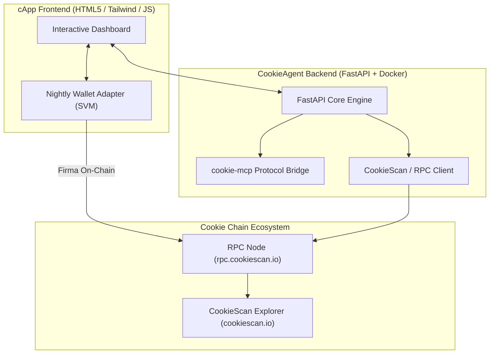

# 🍪 CookieAgent Gateway & Sentinel cApp

[](https://opensource.org/licenses/MIT)
[-orange)](https://docs.cookiechain.wtf)
[-blue)](https://docker.com)
[](https://earn.superteam.fun)

> **Autonomous AI Agent Gateway, Model Context Protocol (MCP) Bridge & Telemetry Dashboard for Cookie Chain (SVM).**

---

## 🌐 Live Interactive Demo
* **Live Application URL**: [http://146.181.24.180:8080](http://146.181.24.180:8080)
* **Interactive Swagger OpenAPI**: [http://146.181.24.180:8080/docs](http://146.181.24.180:8080/docs)
* **Raw MCP Manifest**: [http://146.181.24.180:8080/api/v1/mcp/manifest](http://146.181.24.180:8080/api/v1/mcp/manifest)

---

## 🚀 Key Features

1. **Native Cookie Chain SVM Connectivity**: Real-time interaction with the sub-second finality Cookie Chain RPC (`https://rpc.cookiescan.io`).
2. **Nightly Wallet Standard**: Full support for connecting and transacting with Nightly Wallet on custom SVM networks.
3. **`cookie-mcp` Compatibility**: Exposes Model Context Protocol (MCP) endpoints allowing autonomous AI agents (Claude, Codex, PydanticAI) to query network stats, balances, and trigger state memos.
4. **On-Chain Agent Telemetry**: Broadcast verifiable proofs of agent execution directly onto Cookie Chain with transaction hashes tracked via [CookieScan Explorer](https://cookiescan.io).
5. **Hermetic & Production Ready**: Self-contained multi-stage Alpine Docker container (<80 MB) with zero external commercial dependencies.

---

## 📐 Architecture Overview



---

## 🛠 Quickstart (1-Line Deployment)

### Option A: Run via Docker Compose (Recommended)
```bash
docker compose up -d
```
Visit `http://localhost:8080` or explore the API at `http://localhost:8080/docs`.

### Option B: Local Python Development
```bash
python -m venv venv
source venv/bin/activate  # Or venv\Scripts\activate on Windows
pip install -r requirements.txt
uvicorn app.main:app --host 0.0.0.0 --port 8080 --reload
```

---

## 🧪 Automated Testing
Run the comprehensive test suite with `pytest`:
```bash
pytest tests/test_api.py -v
```

---

## 📜 Official Ecosystem Resources
* **Cookie Chain Documentation**: [https://docs.cookiechain.wtf](https://docs.cookiechain.wtf)
* **Cookie Chain RPC**: `https://rpc.cookiescan.io`
* **CookieScan Block Explorer**: [https://cookiescan.io](https://cookiescan.io)
* **cookie-mcp Specification**: [https://github.com/cookiechain/cookie-mcp](https://github.com/cookiechain/cookie-mcp)
