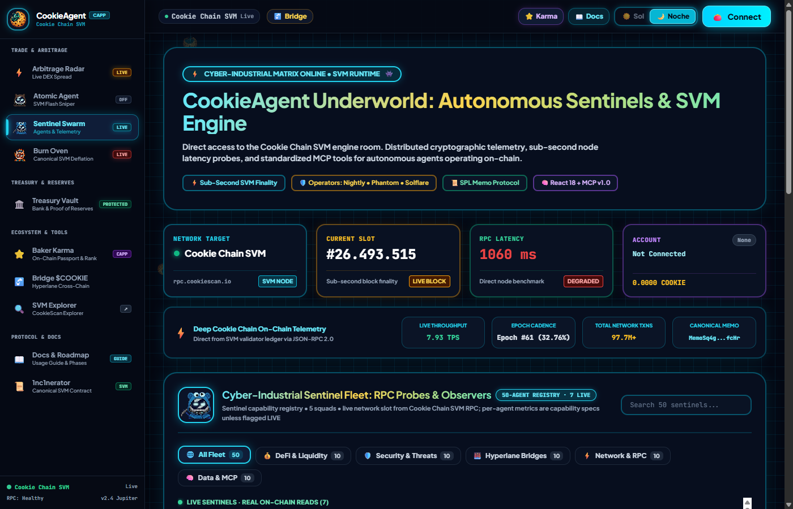
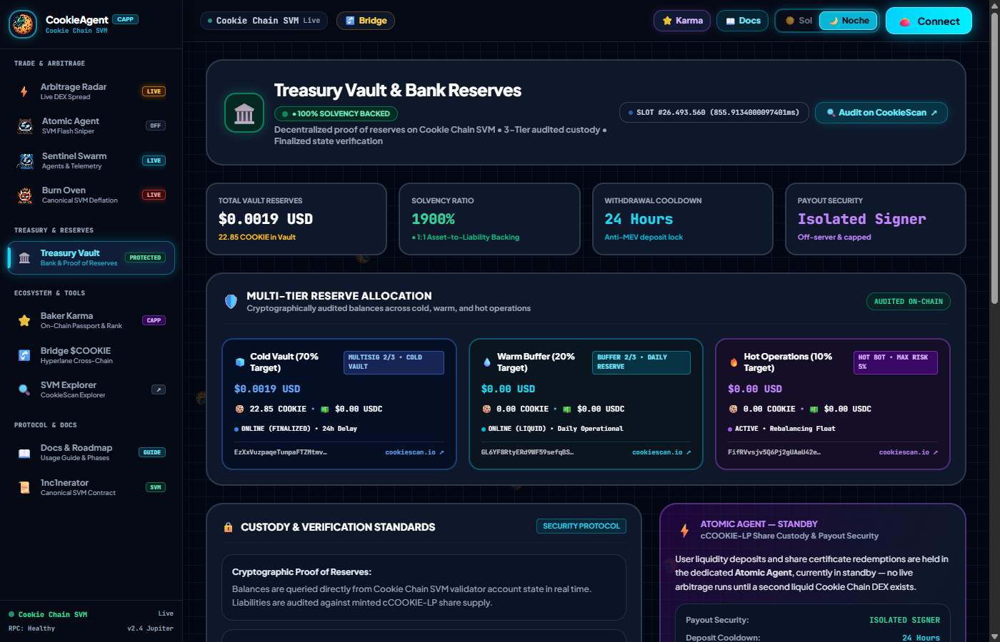
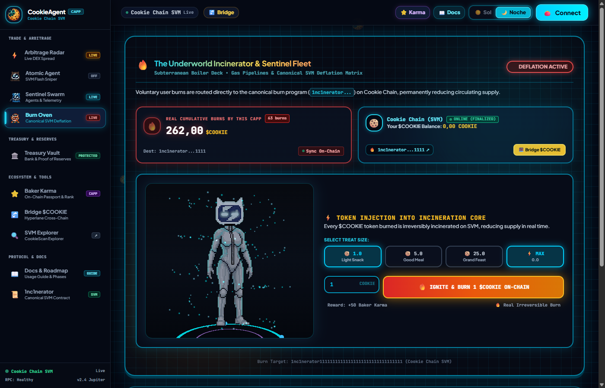
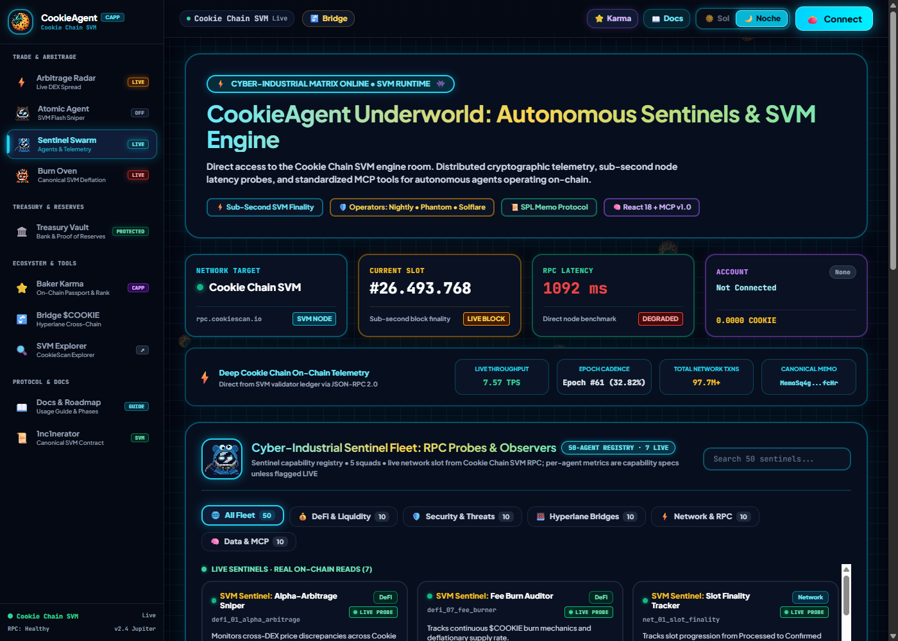

# 🍪 CookieAgent Gateway & Sentinel cApp

<p align="center">
  
</p>

[](https://opensource.org/licenses/MIT)
[-orange)](https://docs.cookiechain.wtf)
[-brightgreen)](tests/test_cookie_atomic.py)
[](https://vitejs.dev)
[](https://github.com/wallet-standard/wallet-standard)
[](/api/v1/mcp/manifest)
[-teal)](https://docker.com)
[](https://earn.superteam.fun)

> **Autonomous AI Agent Gateway, Model Context Protocol (MCP) Bridge, Sentinel Telemetry Swarm, Deflationary Burn Oven & Security-First Vault for Cookie Chain (SVM). Built with React 18, TypeScript, Tailwind CSS, FastAPI, and Docker.**

---

## 🌐 Live Demo & Endpoints

> Self-hosted on a VPS (Docker + Cloudflare Tunnel). After `docker compose up`, replace
> `<YOUR_PUBLIC_URL>` below with your public URL.

* 🚀 **Live Web App**: `<YOUR_PUBLIC_URL>`
* 📚 **Swagger API Docs**: `<YOUR_PUBLIC_URL>/docs`
* 🤖 **MCP Manifest**: `<YOUR_PUBLIC_URL>/api/v1/mcp/manifest`
* 💓 **Health Check**: `<YOUR_PUBLIC_URL>/health`
* 📖 **User Guide & Roadmap**: [docs/USER_GUIDE_AND_ROADMAP.md](docs/USER_GUIDE_AND_ROADMAP.md)
* 🔒 **Security Audit & Hardening**: [docs/SECURITY_AUDIT.md](docs/SECURITY_AUDIT.md) · [docs/ROADMAP_HARDENING.md](docs/ROADMAP_HARDENING.md)

---

## 📸 Screenshots

<!--
  TODO before submitting: run `docker compose up --build -d`, open the app, and drop
  4 PNGs into docs/screenshots/ with these exact names (each ~1280px wide is plenty):
    - docs/screenshots/fleet.png       -> the Sentinel Fleet page (live vs. dimmed/spec agents)
    - docs/screenshots/vault.png       -> Cookie Atomic Vault (Proof-of-Reserves cards)
    - docs/screenshots/burn.png        -> Cookie Burn Oven (burn + Baker Karma leaderboard)
    - docs/screenshots/mcp-manifest.png -> either the Docs/Roadmap modal or GET /api/v1/mcp/manifest in the browser
  These 4 render automatically below once the files exist -- no other edit needed.
-->

<table>
  <tr>
    <td width="50%"><br/><sub align="center">Sentinel Fleet — 6 live agents, 44 dimmed roadmap specs</sub></td>
    <td width="50%"><br/><sub align="center">Cookie Atomic Vault — 3-tier Proof-of-Reserves</sub></td>
  </tr>
  <tr>
    <td width="50%"><br/><sub align="center">Cookie Burn Oven — verifiable burns & Baker Karma leaderboard</sub></td>
    <td width="50%"><br/><sub align="center">cookie-mcp — 18-tool manifest for AI agents</sub></td>
  </tr>
</table>

---

## 🎯 Value Proposition & Technical Integrity

The **CookieAgent Gateway & Sentinel** addresses key infrastructure and onboarding challenges in the Cookie Chain SVM ecosystem:

1. **Universal SVM Onboarding**: Supports **9 Web3 wallets** (Nightly, Phantom, Backpack, OKX, Solflare, Magic Eden, Coinbase Wallet, Brave, and In-Browser Session Keys) using the official **Solana Wallet Standard** and cryptographically grounded **Sign-In with Solana (SIWS)**.
2. **Autonomous AI Agent Bridge (`cookie-mcp`)**: Native bridge exposing **18 Model Context Protocol (MCP) tool endpoints** for autonomous agents (Claude, Codex, PydanticAI, LangChain) to query balances, fetch real-time SVM block telemetry, read the live COOK price, inspect vault positions and Proof-of-Reserves, and broadcast on-chain execution proofs.
3. **⚡ COOK Price Monitor & Security-First Vault**: Shows COOK's **live USD price** straight from its Solana market (DexScreener). Cookie Chain has no COOK/USDC market yet, so **no cross-chain arbitrage is claimed** — the vault sits in transparent standby with on-chain-verified custody (see Security below).
4. **Verifiable On-Chain Telemetry**: Dispatches authentic on-chain SPL Memo transactions directly to the Cookie Chain SVM runtime (`https://rpc.cookiescan.io`), with instantly verifiable transaction hashes on [CookieScan](https://cookiescan.io).
5. **Interactive Deflationary Burn Oven**: Routes burned tokens to the canonical Solana Incinerator address (`1nc1nerator11111111111111111111111111111111`) and tracks cumulative burn amounts in real-time.
6. **Zero Infrastructure Cost ($0/mo)**: Engineered to operate within Oracle Cloud Always Free hardware constraints (RAM ~45 MB, CPU < 1%), with single-stage or containerized delivery.

---

## 🔬 Architecture & Design Truth


### Technical Transparency: What is Live vs. What is Simulated

| Feature | Operational Status | Technical Details |
| :--- | :--- | :--- |
| **RPC Network Stats** | 🟢 **100% Live On-Chain** | Direct queries to `https://rpc.cookiescan.io` fetching slot, block height, blockhash, and epoch. |
| **Wallet Connection & SIWS** | 🟢 **100% Live Cryptographic** | Native provider detection (including Nightly), Ed25519 challenge sign, replay protection. |
| **SPL Memo Broadcast** | 🟢 **100% Live On-Chain** | Transactions sent to SVM runtime with explorer links to `cookiescan.io/tx/...`. |
| **Deflationary Burn Address** | 🟢 **Canonical Address** | Directed to canonical Solana Incinerator / Token-2022 Burn: `1nc1nerator11111111111111111111111111111111`. |
| **Baker Karma & Burns** | 🟢 **On-Chain Verified** | Burns reconciled from RPC against the incinerator; only verified burns count toward Karma. |
| **Proof-of-Reserves** | 🟢 **Live On-Chain Read** | Solvency computed from real balances of the vault addresses; reports `unavailable` if RPC fails (no fabricated solvency). |
| **COOK Price / Vault Yield** | 🟠 **Standby (no fake yield)** | COOK's live USD price is read from its Solana market. Cookie Chain has **no COOK/USDC market**, so there is no cross-chain arbitrage to run — the vault is **paused**, NAV stays 1.0, and no APY/yield is shown or claimed. |
| **Deposits / Withdrawals** | 🔒 **Verified custody, closed by default** | Deposits are verified on-chain against the Cold Vault; withdrawals pay via an **isolated policy-enforcing signer** (two-phase, caps) — no hot key on the API. Public deposits gated off until fully deployed. |

---

## 🔒 Security & Fund Custody

This cApp was hardened with an internal security audit (see [docs/SECURITY_AUDIT.md](docs/SECURITY_AUDIT.md)).
The design goal is simple: **depositor funds must be safe and every claim must be verifiable on-chain.**

* **Zero-trust deposits** — the vault credits shares only for a $COOKIE transfer that is
  confirmed on-chain into the Cold Vault; the amount is **derived from the on-chain balance
  delta**, never trusted from the client.
* **Key never on the public server** — withdrawals are paid by an **isolated,
  policy-enforcing signer service** running on a separate hardened host. The API cannot
  sign; it only *requests* a payout.
* **Signer policy** — per-transaction cap, rolling 24h cap, idempotency (no double-pay),
  and recipient validation. Payouts above the auto cap are queued for manual operator approval.
* **Two-phase withdraw** — shares are burned **only after** the payout is confirmed on-chain,
  so a failed payout never costs a user their position.
* **Honest telemetry** — no fabricated yield, APY, TVL, or "live" arbitrage. COOK's USD price
  is shown live from its Solana market; Cookie Chain has no COOK/USDC market, so the vault
  sits in transparent **standby**, and Proof-of-Reserves reads real balances (or reports
  `unavailable`) rather than faking solvency.

Roadmap toward production custody (k-of-n multi-node signer, server-side SIWS auth) is
tracked in [docs/ROADMAP_HARDENING.md](docs/ROADMAP_HARDENING.md).

---

## 👛 Universal SVM Wallet Support

CookieAgent implements a dual-layer connection adapter supporting both modern `@wallet-standard` specifications and legacy inlined providers:

| Billetera / Wallet | Visual Brand | Integration Layer | Security / Features |
| :--- | :--- | :--- | :--- |
| **Nightly** | Neon Owl Eyes (`#0C1021`) | `window.nightly.solana` | **Official Cookie Chain Recommended Wallet** |
| **Phantom** | Signature Lavender (`#AB9FF2`) | `window.phantom.solana` | SIWS Signature, Multi-chain SVM |
| **Backpack** | Signature Red (`#E33E38`) | `window.backpack` | Native Solana & xNFT community wallet |
| **OKX Wallet** | Minimalist Cubes (`#000000`) | `window.okxwallet.solana` | Global multi-chain Web3 wallet |
| **Solflare** | Solar Flame (`#FF8533`) | `window.solflare` | Classic Solana SVM provider |
| **Magic Eden** | Royal Magenta (`#E42575`) | `window.magicEden.solana` | SVM collectibles & trading wallet |
| **Coinbase Wallet** | Blue Circle (`#0052FF`) | `window.coinbaseSolana` | Direct institutional & retail Web3 access |
| **Brave Wallet** | Brave Lion (`#FB542B`) | `window.braveSolana` | Privacy-focused built-in browser wallet |
| **Session Key** | Emerald Key (`#059669`) | In-Memory Ed25519 Keypair | **$0 Install / Zero friction** instant testing |

### Cryptographic Sign-In with Solana (SIWS)
To eliminate unverified connections, every wallet connection requests an Ed25519 cryptographic signature of a challenge containing:
* Domain verification
* Connected SVM public address
* Cryptographic nonce (replay attack prevention)
* ISO-8601 timestamp
* Network attribution (`Cookie Chain SVM`)

---

## 🛠 API & MCP Tool Specifications

The Gateway exposes standard REST endpoints and 11 Model Context Protocol (MCP) tools:

### REST Endpoints
| Method | Endpoint | Description |
| :--- | :--- | :--- |
| `GET` | `/health` | Service health status, uptime, and memory metrics |
| `GET` | `/api/v1/network/stats` | Real-time slot, block height, blockhash, and latency |
| `GET` | `/api/v1/agents/fleet` | 50-Agent Sentinel Fleet (filterable by squad: `defi`, `security`, `bridge`, etc.) |
| `GET` | `/api/v1/agents/{id}` | Detailed telemetry profile and target program for any agent |
| `GET` | `/api/v1/wallet/{address}` | Query wallet overview: balance, Baker Karma, tier, and vault position |
| `GET` | `/api/v1/wallet/{address}/balance` | Query native `$COOKIE` balance on Cookie Chain |
| `GET` | `/api/v1/opportunities/radar` | Illustrative arbitrage-spread scenarios (labeled simulator, not live detection) |
| `POST` | `/api/v1/opportunities/eat` | Simulated capture projection (clearly flagged `is_simulation`) |
| `GET` | `/api/v1/stats/burn` | Global deflationary metrics (burned tokens, circulating supply, burn rate) |
| `GET` | `/api/v1/airdrop/karma/{address}` | Baker Karma score, tier calculation, and eligibility breakdown |
| `GET` | `/api/v1/vault/info` | Vault status, NAV (1.0 in standby), and real on-chain reserves — no APY claimed |
| `GET` | `/api/v1/vault/position/{address}` | Query user vault shares and principal (no yield while in standby) |
| `POST` | `/api/v1/vault/deposit` | Disabled in production — deposits are credited only via on-chain-verified `/api/v1/atomic/verify-deposit` |
| `POST` | `/api/v1/vault/withdraw` | Two-phase withdraw via the isolated signer (pay → confirm → burn shares) |
| `POST` | `/api/v1/agent/ping` | Autonomous agent pulse test for live telemetry display |
| `GET` | `/api/v1/mcp/manifest` | Model Context Protocol JSON manifest declaring all 18 tool schemas |
| `POST` | `/api/v1/mcp/execute` | Universal execution endpoint for all 18 MCP tools |

### Model Context Protocol (MCP) Tools
The MCP manifest (`/api/v1/mcp/manifest`) provides LLM-ready definitions for:
1. `cookie_get_network_stats`: Fetch real-time slot, block height, blockhash, and TPS from Cookie Chain SVM.
2. `cookie_check_balance`: Query native `$COOKIE` balance for any SVM address.
3. `cookie_simulate_agent_ping`: Dispatch an autonomous on-chain telemetry ping or state proof.
4. `cookie_resolve_explorer_url`: Generate official CookieScan explorer URLs for accounts, transactions, and tokens.
5. `cookie_list_agent_fleet`: Retrieve all 50 active sentinel agents filtered by squad.
6. `cookie_get_bridge_guide`: Instructions for acquiring $COOKIE and bridging via Hyperlane.
7. `cookie_scan_arbitrage_crumbs`: Return illustrative arbitrage-spread scenarios (labeled simulator, not live detection).
8. `cookie_calculate_airdrop_karma`: Calculate on-chain Baker Karma score and airdrop qualification tier.
9. `cookie_get_burn_stats`: Inspect cumulative burned tokens and real-time deflation metrics.
10. `cookie_vault_get_status`: Query Treasury Vault TVL, NAV share price, and reserve breakdown.
11. `cookie_vault_get_user_position`: Fetch user vault shares (`cCOOKIE-LP`) and withdrawable balances.
12. `cookie_atomic_get_spreads`: Return COOK's live Solana price and the (standby) cross-chain differential — no live Cookie Chain USD market exists yet.
13. `cookie_atomic_get_vault_status`: Retrieve Cookie Atomic Engine & Proof-of-Reserves solvency audit.
14. `cookie_atomic_simulate_route`: Simulate atomic order sizing, price impact, and net profit before execution.

---

## 💻 Local Development & Deployment

### Option A: Docker Compose (1-Line Deployment)
```bash
git clone https://github.com/cookie-agent/cookie-agent-capp.git
cd cookie-agent-capp
docker compose up --build -d
```
Visit `http://localhost:8081` in your browser.

### Option B: Local Python & Node Development

1. **Frontend Build**:
```bash
cd frontend
npm install
npm run build   # Outputs production bundle into ../static/
cd ..
```

2. **Backend Execution**:
```bash
python -m venv venv
# On Windows: venv\Scripts\activate | On Linux/macOS: source venv/bin/activate
pip install -r requirements.txt
uvicorn app.main:app --host 0.0.0.0 --port 8081 --reload
```

---

## 🧪 Automated Testing

The project includes an extensive test suite verifying all 18 MCP tools, REST endpoints, and the Cookie Atomic vault engine:

```bash
python -m pytest -v
```

### Test Suite Results (44/46 Passed, 2 Skipped)

44 of 46 tests pass in a network-restricted environment; the remaining 2 make a live
RPC call (Solana Mainnet blockhash proxy, and a Cookie Chain `simulateTransaction`
probe) and skip gracefully with an explicit reason when that network access isn't
available, rather than failing or faking a result. All 46 pass on a host with real
RPC access (e.g. the deployed VPS). Covers the REST API, the 18 MCP tools, burn
tracking, the atomic engine math, and the security invariants added during the
hardening pass:

* **Deposit zero-trust**: a fabricated / non-existent deposit tx is rejected (no shares minted from thin air).
* **Withdraw two-phase**: a signer failure does **not** burn shares; a payout above the auto cap is queued for manual approval with shares intact.
* **Honest telemetry**: standby engine returns `STANDBY_NO_LIQUIDITY` (no fabricated profit / NAV), Proof-of-Reserves reflects real solvency.

```bash
python -m pytest -q      # 44 passed, 2 skipped (skips need live RPC access)
```

---

## 📜 Ecosystem References & Documentation

* **Cookie Chain Official Docs**: [https://docs.cookiechain.wtf](https://docs.cookiechain.wtf)
* **Cookie Chain Wallet Guide**: [https://docs.cookiechain.wtf/wallets](https://docs.cookiechain.wtf/wallets)
* **CookieScan Explorer**: [https://cookiescan.io](https://cookiescan.io)
* **cookie-mcp GitHub Repository**: [https://github.com/cookiechain/cookie-mcp](https://github.com/cookiechain/cookie-mcp)
* **Canonical Solana Incinerator**: `1nc1nerator11111111111111111111111111111111`
* **Cookie Chain Community Web**: [https://www.cookiechain.wtf](https://www.cookiechain.wtf)
