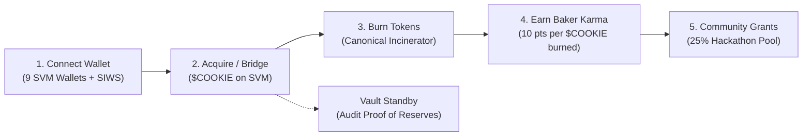

# 🍪 CookieAgent Gateway & Sentinel: User Guide & Strategic Roadmap

> **Author**: CookieAgent Gateway & Sentinel Team  
> **Target Audience**: Cookie Chain Community, DeFi Users, Developers & Superteam Earn Judges  
> **Network**: Cookie Chain (SVM) — `https://rpc.cookiescan.io`  
> **Canonical Incinerator**: `1nc1nerator11111111111111111111111111111111`  
> **Cold Vault Treasury**: `EzXxVuzpaqeTunpaFTZMtmvENzij5BMoP4Lh8zZkfSjh`  

---

## 📌 Executive Summary

**CookieAgent Gateway & Sentinel cApp** is an autonomous AI agent gateway, deflationary burn orchestrator, and liquidity sentinel built natively for Cookie Chain SVM. It bridges the gap between high-speed SVM block finality (400ms slots) and autonomous multi-agent systems via the **Model Context Protocol (`cookie-mcp`)**.

This document outlines:
1. **User Guide**: Step-by-step instructions on how to use the web application, connect wallets, execute verifiable on-chain burns, accumulate Baker Karma, and audit vault reserves.
2. **Protocol Roadmap**: A structured three-phase roadmap tracking current delivered milestones and future autonomous horizons.
3. **Developer & Agent Specifications**: OpenAPI endpoints and MCP tool capabilities.

---

## 🚀 Part 1: User Guide (How to Use the Application)



### Step 1: Connect Your SVM Wallet
1. Open the application at [http://localhost:8000](http://localhost:8000) or our live deployment.
2. Click **Connect Wallet** in the top navigation bar or sidebar.
3. Choose your preferred wallet:
   - **Nightly Wallet** (Recommended: Native network preset on Cookie Chain).
   - **Phantom, Backpack, Solflare, OKX, Magic Eden, Coinbase, Brave**.
   - **Session Key**: Instant in-browser cryptographic Ed25519 keypair ($0 cost, no browser extension required).
4. **Sign-In with Solana (SIWS)**: Approve the cryptographic challenge signature. This verifies public key ownership with zero gas fees.

### Step 2: Acquire $COOKIE & Bridge
- **Direct Funding**: Ensure your wallet holds $COOKIE on Cookie Chain SVM (`https://rpc.cookiescan.io`).
- **Cross-Chain Bridge**: If your assets are on Solana Mainnet (Jupiter / Raydium) or Arbitrum, bridge them to Cookie Chain using the [Hyperlane Bridge](https://hyperlane.cookiescan.io).

### Step 3: Burn $COOKIE in the Deflationary Oven
1. Navigate to the **Burn** tab.
2. Select or enter the quantity of $COOKIE you want to burn.
3. Click **Bake & Burn On-Chain**.
4. Confirm the transaction in your wallet.
   - The transaction transfers tokens to the canonical Solana Incinerator address: `1nc1nerator11111111111111111111111111111111`.
   - The backend validates the transaction on-chain via the Cookie Chain RPC and records a permanent verifiable entry with explorer links.

### Step 4: Accumulate Baker Karma Points
- **10 Karma points** awarded for every verified $COOKIE burned.
- **1 Karma point** awarded for every $COOKIE deposited in vault custody.
- **Tiers & Multipliers**:
  - **Novice Baker** (0–99 pts, 1.0x)
  - **Apprentice Baker** (100–499 pts, 1.5x)
  - **Master Oven Guard** (500–999 pts, 2.0x)
  - **Sentinel Grandmaster** (1,000+ pts, 3.0x)
- **Grant Eligibility**: 25% of the hackathon reward pool is reserved as a retroactive community incentive distributed proportionally according to verified Baker Karma.

### Step 5: Cookie Atomic Vault (Standby Sentinel & Proof of Reserves)
- **Standby Sentinel Mode**: To protect user capital, active high-frequency automated arbitrage trades are paused until on-chain decentralized liquidity on Cookoven reaches sustainable depth ($COOKIE/USDC pool).
- **Proof of Reserves (PoR)**: Users can audit the vault's solvency at any time. The engine queries live on-chain balances across the multi-tier structure:
  - **70% Cold Storage** (Cold treasury, deposit address; payouts via an isolated off-server signer: `EzXxVuzpaqeTunpaFTZMtmvENzij5BMoP4Lh8zZkfSjh`).
  - **20% Warm Buffer** (Liquidity cushion).
  - **10% Hot Bot** (Trading balance).

---

## 🗺️ Part 2: Strategic Roadmap

```mermaid
timeline
    title CookieAgent Evolution Timeline
    section Phase 1 : Completed (Delivered)
        9-Wallet SVM Adapter : SIWS Cryptographic Auth
        Verifiable Burn Engine : 100% On-Chain RPC Sync
        Baker Karma Scoring : On-Chain Passport Cert
        Proof of Reserves : Cold Storage Solvency Telemetry
        14 MCP Tools : cookie-mcp Autonomous Bridge
    section Phase 2 : Current Milestone
        Multi-Node Signer : k-of-n treasury payouts
        Server-Side SIWS Auth : per-address verification
        Cookie Chain USD Market : prerequisite before any vault trading
        Community Grant Distribution : Reward pool to Baker Karma
    section Phase 3 : Future Horizon
        Autonomous Agent Swarms : Cross-chain Hyperlane rebalance
        Protocol Buy-Back & Burn : funded only by real revenue
        DAO Governance : On-chain parameter adjustment
```

### Phase 1: MVP & Verifiable Core Infrastructure *(Completed)*
- [x] **Universal 9-Wallet SVM Standard Adapter**: Seamless connection supporting Nightly, Phantom, Backpack, Solflare, OKX, Magic Eden, Coinbase, Brave, and Session Keys.
- [x] **Zero-Simulation On-Chain Burn Verification**: Elimination of synthetic logs; 100% authentic transaction verification via `https://rpc.cookiescan.io`.
- [x] **Baker Karma & Leaderboard**: Anti-cheat mathematical score weighting real burns and vault holdings.
- [x] **Cryptographic Proof of Reserves**: Real-time solvency tracking matching on-chain cold vault balances to minted shares (`cCOOKIE-LP`).
- [x] **14 Model Context Protocol (`cookie-mcp`) Tools**: Comprehensive toolset for autonomous agents to query state, inspect blocks, and simulate execution.

### Phase 2: Custody Hardening & Cookie Chain Liquidity *(In Progress)*
- [ ] **Multi-Node Signer**: extend treasury payouts from the current single isolated signer to a k-of-n approval across independent hosts, so no single machine can move funds.
- [ ] **Server-Side SIWS Auth**: verify wallet signatures on the server so nobody can act on another address's karma, position, or payout.
- [ ] **Cookie Chain USD Market (prerequisite)**: COOK only has a USD market on Solana today. A COOK/USDC pool must exist on Cookie Chain before the vault can price or trade in USD — until then the vault stays in transparent standby custody and no yield is claimed.
- [ ] **Community Grant Distribution**: distributing a share of the reward pool proportionally to Baker Karma leaderboard leaders.

### Phase 3: Autonomous Agent Swarms & Cross-Chain DAO *(Future Horizon)*
- [ ] **Cross-Chain Hyperlane Routing**: Autonomous settlement synchronizing Cookie Chain SVM with Solana Mainnet and Base.
- [ ] **AI Swarm Parameter Governance**: Autonomous sentinel agents dynamically adjusting vault order size and risk thresholds according to market volatility.
- [ ] **Protocol Buy-Back & Burn**: if the protocol earns real on-chain revenue, direct a share to burn $COOKIE — funded only by actual surplus, never promised in advance.

---

## ⚙️ Part 3: Developer & Agent Integration (`cookie-mcp`)

### REST API Endpoints
| Method | Endpoint | Description |
| :--- | :--- | :--- |
| `GET` | `/health` | Gateway health check & RPC latency ping |
| `GET` | `/api/v1/network/stats` | Real-time block height, slot & epoch |
| `GET` | `/api/v1/stats/burn` | Cumulative verified $COOKIE burned |
| `POST` | `/api/v1/burn/record` | Record and verify on-chain burn transaction |
| `GET` | `/api/v1/atomic/status` | Vault TVL, NAV price & Standby Sentinel state |
| `GET` | `/api/v1/atomic/proof-of-reserves` | Live on-chain Cold Vault solvency breakdown |
| `GET` | `/api/v1/airdrop/karma/{address}` | Verified Baker Karma score & tier ranking |
| `GET` | `/api/v1/mcp/manifest` | Model Context Protocol JSON schema (14 tools) |

### Interactive Swagger UI
Explore and execute live requests directly in your browser:
* Local: `http://localhost:8081/docs`
* Production: `<YOUR_PUBLIC_URL>/docs`

---

## 🔐 Canonical Addresses & Network Parameters

| Parameter | Value | Explorer |
| :--- | :--- | :--- |
| **Network Name** | Cookie Chain (SVM) | `https://cookiescan.io` |
| **RPC Endpoint** | `https://rpc.cookiescan.io` | — |
| **WebSocket** | `wss://wss.cookiescan.io` | — |
| **Bridge** | `https://hyperlane.cookiescan.io` | — |
| **Canonical Incinerator** | `1nc1nerator11111111111111111111111111111111` | [View on CookieScan](https://cookiescan.io/address/1nc1nerator11111111111111111111111111111111) |
| **Cold Vault (Treasury)** | `EzXxVuzpaqeTunpaFTZMtmvENzij5BMoP4Lh8zZkfSjh` | [View on CookieScan](https://cookiescan.io/address/EzXxVuzpaqeTunpaFTZMtmvENzij5BMoP4Lh8zZkfSjh) |
